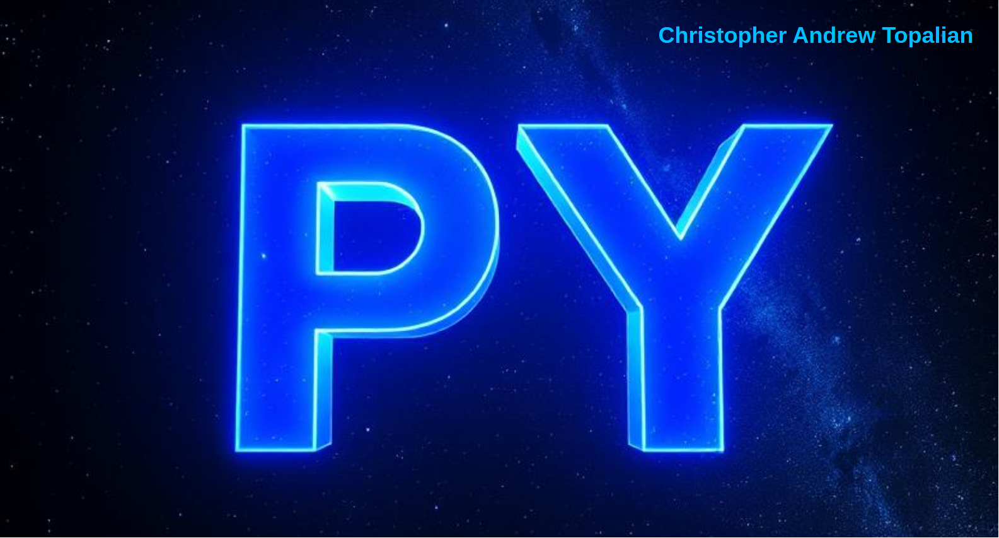

# CATopalian Python Library
A pure functional Python Library that includes many useful functions.

---

---

# **Date**

### [**getDayOfMonth**](src/py/date/getDayOfMonth.py)  
5

### [**getYearMonthDay**](src/py/date/getYearMonthDay.py)  
2025/9/5

### [**getDayOfWeekName**](src/py/date/getDayOfWeekName.py)  
Monday

---

# **Date Time**

### [**getYearMonthDay24**](src/py/date_time/getYearMonthDay24.py)  
2025-09-05 21:42:02.290152

---

//----//

// Dedicated to God the Father
// All Rights Reserved Christopher Andrew Topalian Copyright 2000-2025
// https://github.com/ChristopherTopalian
// https://github.com/ChristopherAndrewTopalian
// https://sites.google.com/view/CollegeOfScripting

