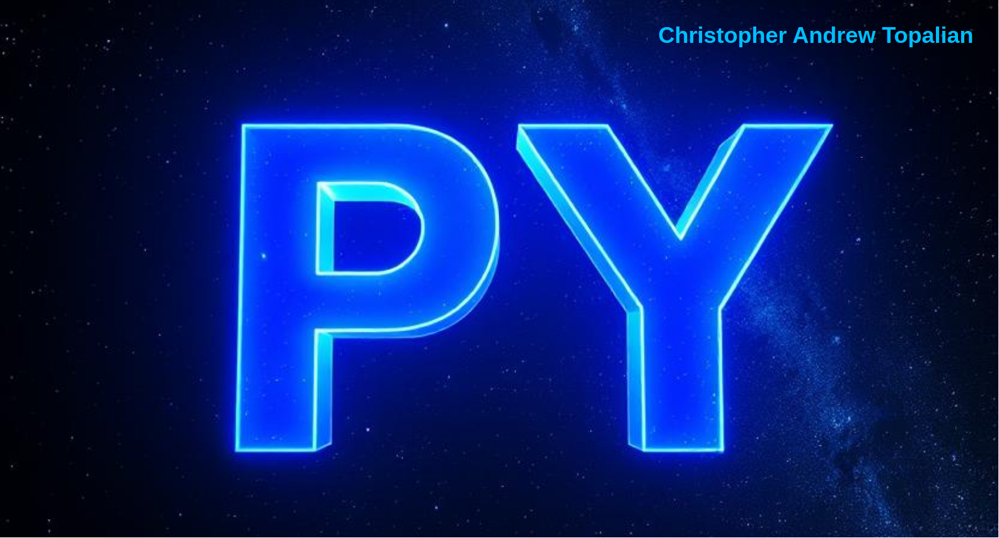

# CATopalian Python Library
A pure functional Python Library that includes many useful functions.

---

---

# **Date**

### [**get_year**](src/py/date/get_year.py)  
2026

### [**get_month_number**](src/py/date/get_month_number.py)  
9

### [**get_day_of_month**](src/py/date/get_day_of_month.py)  
5

### [**get_year_month_day**](src/py/date/get_year_month_day.py)  
2025-09-06

### [**get_month_day_year**](src/py/date/get_month_day_year.py)  
08-20-2026

### [**get_year_month_day_slash**](src/py/date/get_year_month_day_slash.py)  
2025/9/5

### [**get_day_of_week_name**](src/py/date/get_day_of_week_name.py)  
Monday

### [**get_day_of_week_number**](src/py/date/get_day_of_week_number.py)  
7

### [**get_day_of_week_number_7**](src/py/date/get_day_of_week_number_7.py)  
6

---

# **Date Time**

### [**get_date_time_12**](src/py/date_time/get_date_time_12.py)  
09-06-25 05:10 AM

### [**get_year_month_day_24**](src/py/date_time/get_year_month_day_24.py)  
2025-09-05 21:42:02.290152

### [**is_target_date**](src/py/date/is_target_date.py)  
2026-08-20

---

# Time

### [**getTime12**](src/py/time/getTime12.py)  
05:50:01 AM  

### [**getTime24**](src/py/time/getTime24.py)  
05:53:49  

### [**getHours24**](src/py/time/getHours24.py)  
7 

### [**getHours12**](src/py/time/getHours12.py)  
07 AM

### [**getMinutes**](src/py/time/getMinutes.py)  
27

### [**getSeconds**](src/py/time/getSeconds.py)  
10

---

# Filter
### [**filterByYear**](src/py/filter/list_of_dictionaries/filterByYear.py)  

### [**filterByMonth**](src/py/filter/list_of_dictionaries/filterByMonth.py)  

### [**filterByDay**](src/py/filter/list_of_dictionaries/filterByDay.py)  

### [**filterByYearMonth**](src/py/filter/list_of_dictionaries/filterByYearMonth.py)  

### [**filterBeforeDate**](src/py/filter/list_of_dictionaries/filterBeforeDate.py)  

### [**filterAfterDate**](src/py/filter/list_of_dictionaries/filterAfterDate.py)  

### [**filterBetweenDates**](src/py/filter/list_of_dictionaries/filterBetweenDates.py)  

### [**filterOutsideDates**](src/py/filter/list_of_dictionaries/filterOutsideDates.py)  

### [**filterByDate**](src/py/filter/list_of_dictionaries/filterByDate.py)  

### [**filterByDateTime**](src/py/filter/list_of_dictionaries/filterByDateTime.py)  

### [**filterByMonthDay**](src/py/filter/list_of_dictionaries/filterByMonthDay.py)  

### [**filterByName**](src/py/filter/list_of_dictionaries/filterByName.py)  

### [**filterByNameCS**](src/py/filter/list_of_dictionaries/filterByNameCS.py)  

### [**filterShowAll**](src/py/filter/list_of_dictionaries/filterShowAll.py)  

### [**filterShowAllNames**](src/py/filter/list_of_dictionaries/filterShowAllNames.py)  

### [**filterShowAllDates**](src/py/filter/list_of_dictionaries/filterShowAllDates.py)  

---

# Math

## Lists

### [**getMin**](src/py/math/lists/getMin.py)  

### [**get_max**](src/py/math/lists/get_max.py)  

---

## Dictionaries

### [**getMinByKey**](src/py/math/lists_of_dictionaries/getMinByKey.py)  

### [**getMaxByKey**](src/py/math/lists_of_dictionaries/getMaxByKey.py)  

---

# EXTRA

## Legacy

[**getAsctime**](src/py/legacy/getAsctime.py)  
Sat Sep  6 12:34:56 2025  
Made for C compatibility (fixed-width formatting, not recommended for modern use)  

//----//

// Dedicated to God the Father  
// All Rights Reserved Christopher Andrew Topalian Copyright 2000-2025  
// https://github.com/ChristopherTopalian  
// https://github.com/ChristopherAndrewTopalian  
// https://sites.google.com/view/CollegeOfScripting

